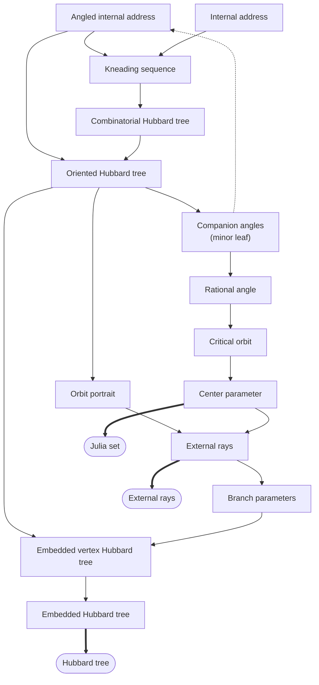
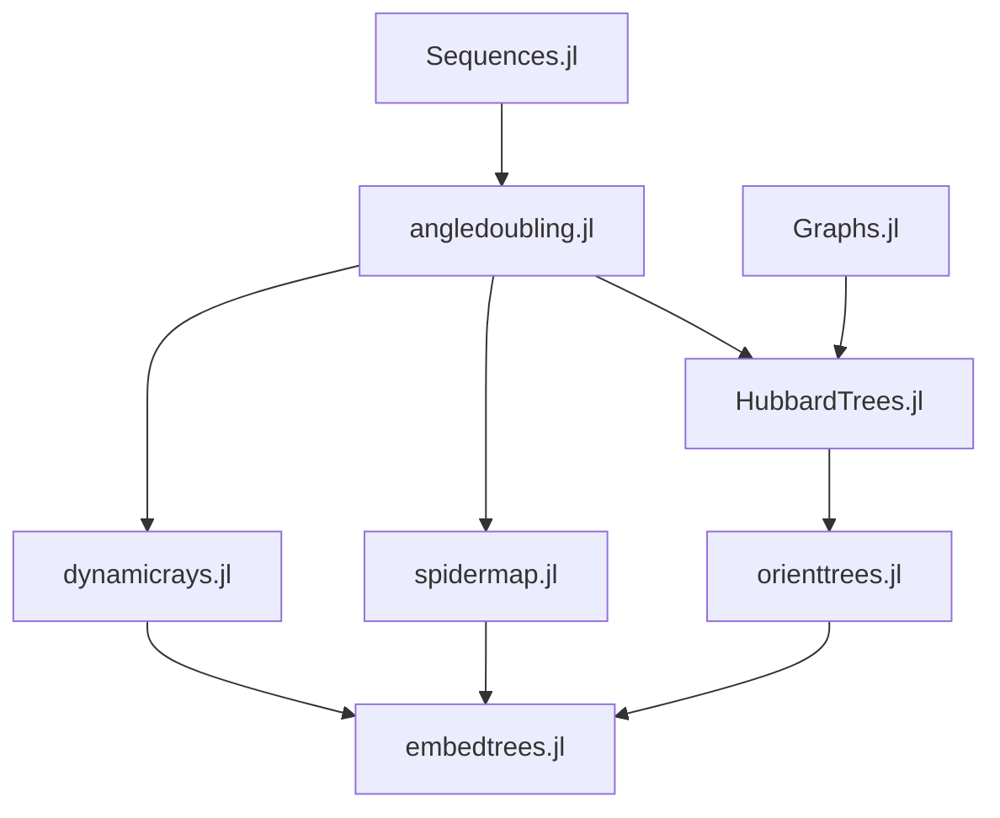

# Mandelbrot

## Summary

This package implements several algorithms related to complex quadratic dynamics. 
- The spider algorithm calculates the center of a hyperbolic component of the Mandelbrot set from one of its external angles. [Read about the spider algorithm.](https://pi.math.cornell.edu/~hubbard/SpidersFinal.pdf)
- The external angles of a hyperbolic component can be calculated from an angled internal address, describing the path to this component from zero. [Read about internal addresses.](https://arxiv.org/abs/math/9411238)
- A combinatorial description of a Hubbard trees can be generated from a kneading sequence, and when oriented in the plane can produce external angles. [Read about Hubbard trees.](https://www.mat.univie.ac.at/~bruin/papers/bkafsch.pdf)

## Algorithm Flow

## Source File Dependencies

