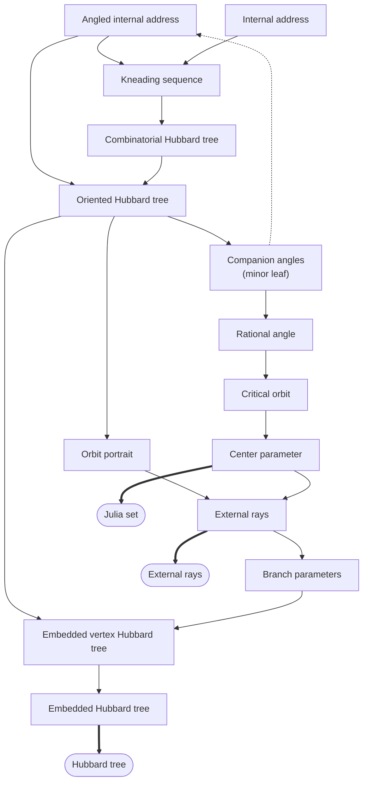
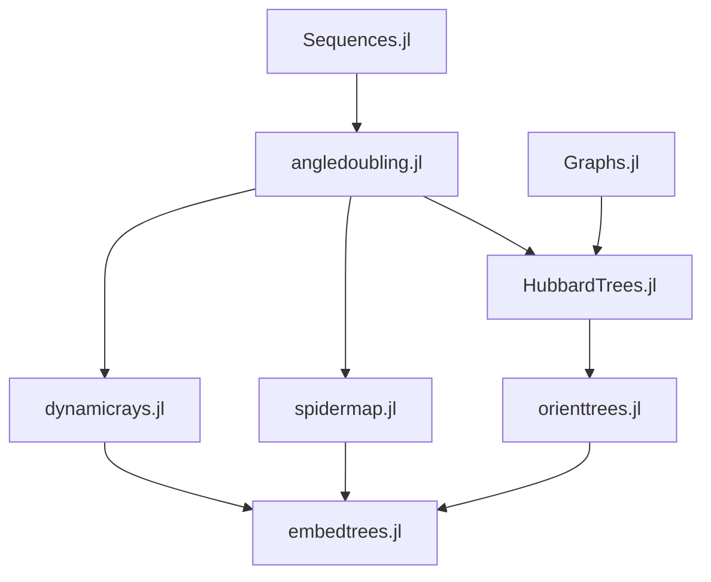

# Mandelbrot.jl

## Package Features
- Calculate things about the Mandelbrot set

## Algorithm Flow



## Source File Dependencies



## Function Documentation

```@docs
KneadingSequence
```
```@docs
BinaryExpansion
```
```@docs
OrientedHubbardTree
```
```@docs
InternalAddress
```
```@docs
HubbardTree
```
```@docs
AngledInternalAddress
```